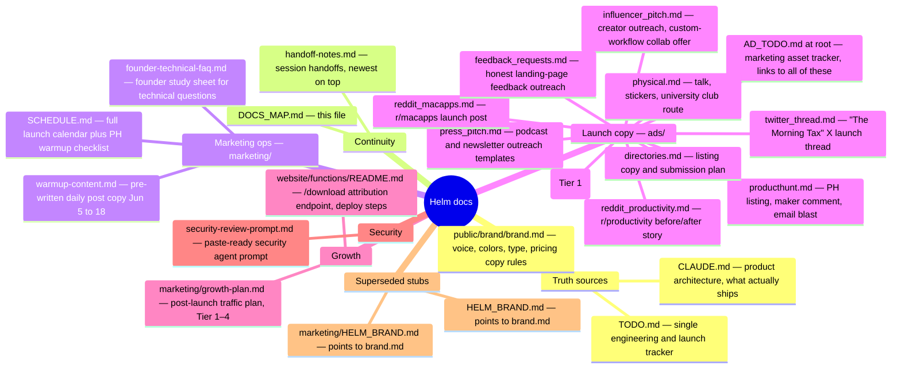

# Helm — Document Map

> What every .md file is and where it lives. Pointed to from CLAUDE.md.
> Rule of precedence: **CLAUDE.md** is the authority on what the product
> actually does; **brand.md** is the authority on voice, design, and pricing
> copy; **TODO.md** is the single engineering tracker. Everything else serves
> those three.

## Flat list

| File | What it is |
|---|---|
| `CLAUDE.md` | Product architecture. **Authority on what ships** — never promise a feature not in here. |
| `public/brand/brand.md` | Canonical brand doc: voice rules, colors, typography, pricing copy rules. Treat as law for all copy. |
| `TODO.md` | Single engineering/launch tracker (blockers, review passes B/S/N). |
| `AD_TODO.md` | Marketing asset tracker — links every ads/ file, carries the video deadlines. |
| `handoff-notes.md` | Session-to-session state, newest entry on top. **Fresh sessions start here.** |
| `DOCS_MAP.md` | This file. |
| `security-review-prompt.md` | Paste into a fresh agent to run the pre-launch security review → `SECURITY_REVIEW.md`. |
| `marketing/SCHEDULE.md` | The launch calendar: warmup posts, Non-Traditional Channels table (dated), PH founder warmup checklist, launch-day run-of-show. |
| `marketing/warmup-content.md` | Exact post copy per day, Jun 5–18, per platform, with ✅/⬜ status markers. |
| `marketing/founder-technical-faq.md` | Founder study sheet — the ~15 technical questions every channel asks, answers derived from the code. |
| `ads/producthunt.md` | PH tagline/description/gallery, maker first comment, launch email blast. DRAFT — founder review before publish. |
| `ads/show-hn.md` | ⛔ DROPPED (Jun 14) — Helm not launching on HN. Kept only as a technical-copy source. |
| `ads/press_pitch.md` | Outreach templates (MPU, Automators, MacStories, Sweet Setup, 9to5Mac) + send tracker. DRAFT — founder review. |
| `ads/directories.md` | Directory listing copy, "why not Raycast" boilerplate, submission dates. DRAFT — founder review. |
| `ads/influencer_pitch.md` | Micro-YouTuber/creator outreach: targets, custom-workflow collab offer, YouTube + X templates, tracker. DRAFT — founder review. |
| `ads/physical.md` | Lightning-talk outline, sticker/QR spec, university club targets + contact channels + message. |
| `ads/reddit_macapps.md` | r/macapps launch post (Jul 3) — title options, body, subreddit rules, watched number. DRAFT — founder review. |
| `ads/reddit_productivity.md` | r/productivity before/after story post — ad-sensitive framing, link-in-comment rule. DRAFT — founder review. |
| `ads/twitter_thread.md` | "The Morning Tax" 6-tweet X launch thread — posting rules, native-video reveal. DRAFT — founder review. |
| `ads/feedback_requests.md` | Honest landing-page feedback outreach — subreddit list, post templates, owns-the-page rule. DRAFT — founder review. |
| `ads/linkedin.md` | **Post-launch Tier 1.** Founder posting cadence (8 drafts), comment-engagement playbook, EA / chief-of-staff outreach templates. Carries the attribution blocker. DRAFT — founder review. |
| `website/functions/README.md` | Deploy + verification guide for the `/download?src=` attribution endpoint. **Read before deploying the site** — the Function needs a `HELM_STATS` KV binding and assumes the CF Pages root directory is `website`. |
| `marketing/growth-plan.md` | Post-launch traffic strategy. Diagnosis: conversion is fine, the launch channels reached builders not executives. Tiers 1–4 by priority. |
| `HELM_BRAND.md`, `marketing/HELM_BRAND.md` | Superseded — pointer stubs to `public/brand/brand.md`. Do not edit. |

All planned `ads/` **copy** files now exist. Remaining ads/ deliverables are
assets, not copy: the `workflow_{designer,dev,founder}.json` templates
(companion to influencer_pitch.md), the demo MP4, the end card, and the Reddit
inline screenshot — all tracked in AD_TODO.md.

Known consumer that CANNOT read these files: the daily-brief cloud routine
(`trig_01PgtPoTk8pcJQcC8sBzWY7d`) — its calendar is embedded in its prompt.
If SCHEDULE.md dates change, update the routine too.
